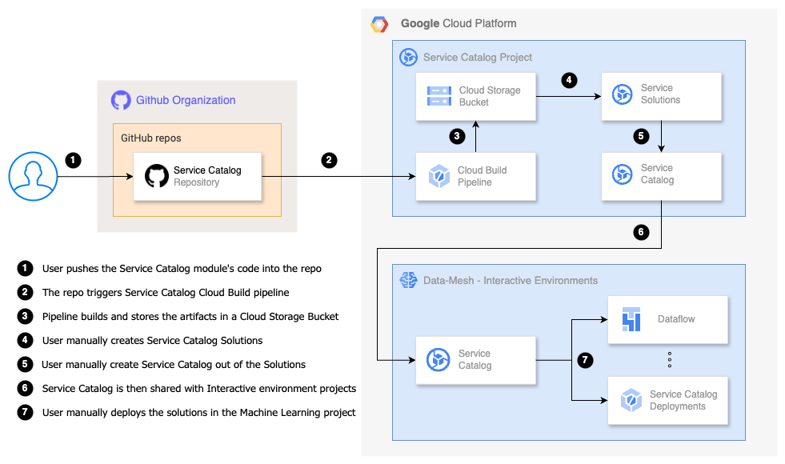

# The Service Catalog

This repo provides a number of the [Google Service Catalog](https://cloud.google.com/service-catalog) Terraform-based solution modules:

<table>
<tbody>
<tr>
<td><a href="../0-vpc-sc">0-vpc-sc</a></td>
<td>Runs a local terraform plan that outputs the necessary configurations for your Service Perimeter.</td>
</tr>
<tr>
<td><a href="../1-tag-engine-oauth">1-tag-engine-oauth</a></td>
<td>Instructions on how to configure OAUTH needed for Data Mesh's Tag Engine.</td>
</tr>
<tr>
<td><a href="../2-artifacts-project">2-artifacts-project</a></td>
<td>Sets up a repository structure and instructions on deploying the artifacts project</td>
</tr>
<tr>
<td><a href="../3-artifact-publish">3-artifact-publish</a></td>
<td>A repository structure containing Dockerfiles and python packages that will be used for building and publishing artifacts</td>
</tr>
<tr>
<td><a href="../4-data-governance">4-data-governance</a></td>
<td>A repository structure containing instructions on deploying the data governance project</td>
</tr>
<tr>
<td><a href="../5-service-catalog-project">5-service-catalog-project</a></td>
<td>A repository structure containing instructions on deploying the service catalog project</td>
</tr>
<tr>
<td><a href="../6-service-catalog-solutions">6-service-catalog-solutions</a></td>
<td>Instructions on how to configure Service Catalog</td>
</tr>
<tr>
<td><a href="../7-data-domain-1-nonconfidential">7-data-domain-1-nonconfidential</a></td>
<td>A repository structure containing instructions on deploying the non-confidential data project</td>
</tr>
<tr>
<td><a href="../8-data-domain-1-ingest">8-data-domain-1-ingest</a></td>
<td>A repository structure containing instructions on deploying the ingest project</td>
</tr>
<tr>
<td><a href="../9-data-domain-1-confidential">9-data-domain-1-confidential</a></td>
<td>A repository structure containing instructions on deploying the confidential data project</td>
</tr>
<tr>
<td><a href="../10-run-cdmc-engines">10-run-cdmc-engines</a></td>
<td>Instructions on how to run the CDMC engines</td>
</tr>
<tr>
<td><a href="../11-consumer-1">11-consumer-1</a></td>
<td>A repository structure containing instructions on deploying the Consumer project</td>
</tr>
<tr>
<td><a href="../12-adding-additional-data">12-adding-additional-data</a></td>
<td>Instructions on how to add additional data domains and/or datasets to an existing data domain</td>
</tr>
</tbody>
</table>

## Overview

<table>
<tbody>
<tr>
<td><a href="modules/bigquery/README.md">bigquery</a></td>
<td>BigQuery is a serverless and cost-effective enterprise data warehouse that works across clouds and scales with your data. Use built-in ML/AI and BI for insights at scale. </td>
</tr>
<tr>
<td><a href="modules/bucket/README.md">bucket</a></td>
<td>Cloud Storage is a managed service for storing unstructured data. </td>
</tr>
<tr>
<td><a href="modules/pubsub/README.md">pubsub</a></td>
<td>Pub/Sub is an asynchronous and scalable messaging service that decouples services producing messages from services processing those messages.</td>
</tr>
<tr>
<td><a href="modules/dataflow/README.md">Dataflow</a></td>
<td>Streaming analytics for real-time intelligence and gen AI.</td>
</tr>
</tbody>
</table>

## Deploying with Cloud Build

1. Clone the freshly minted Cloud Source Repository that was created for this project.
   ```shell
   git clone git@github.com:[git-owner-name]/gcp-dm-bu4-service-catalog-solutions.git bu4-service-catalog-solutions
   ```
1. Enter the repo folder and copy over the service catalogs files from `5-app-infra/6-service-catalog-solutions` folder.
   ```shell
   cd bu4-service-catalog-solutions
   cp -RT ../gcp-data-mesh-foundations/5-app-infra/6-service-catalog-solutions/ .
   ```
1. Update `logging_bucket_name` in modules/bucket/variables.tf`.
   ```shell
   export logging_bucket_name=$(terraform -chdir="../gcp-org/envs/shared" output -raw logs_export_storage_bucket_name)
   sed -i'' -e "s/LOGGING_BUCKET_NAME/${logging_bucket_name}/" modules/bucket/variables.tf
   ```
1. Update `restricted_host_project_id` in `modules/dataflow/variables.tf`.
   ```shell
   export restricted_host_project_id=$(terraform -chdir="../gcp-networks/envs/development" output -raw restricted_host_project_id)
   sed -i'' -e "s/RESTRICTED_HOST_PROJECT_ID/${restricted_host_project_id}/" modules/dataflow/variables.tf
   ```
1. Grab the service catalog project ID:
   ```bash
   SERVICE_CATALOG_PROJECT_ID=$(terraform -chdir="../gcp-projects/business_unit_4/shared/" output -json service_catalog | jq -r '.project_id')

   echo "SERVICE_CATALOG_PROJECT_ID: ${SERVICE_CATALOG_PROJECT_ID}"
   ```


1. Commit changes and push main branch to the new repo.
   ```shell
   git add .
   git commit -m 'Initialize Service Catalog Build Repo'

   git push --set-upstream origin main
   ```

1. Navigate to the project that was output from `${SERVICE_CATALOG_PROJECT_ID}` in Google's Cloud Console to view the first run of images being built.


## Building with Cloud Build

The Service Catalog solutions are built and published as artifacts to the Google Cloud Storage bucket with the Cloud Build CI/CD pipeline, in the `service-catalog` project in the `common` environment, as per the diagram below:



The build is triggered by code push into the `service-catalog` Git (or Cloud Source Repositories). The pipeline builds the solution artifacts (one per module) and copies them into the Cloud Storage Bucket.

Once the modules are copied to the bucket, they can be used to create Terraform-based Solutions on the Service Catalog Admin page, see [Creating the configuration in Service Catalog](https://cloud.google.com/service-catalog/docs/terraform-configuration#create_config).

The Solutions then can be added to one or more [Service Catalogs](https://cloud.google.com/service-catalog/docs/create-catalog) and then [shared](https://cloud.google.com/service-catalog/docs/share-catalog) with the other projects in the `DEVELOPMENT` environment to be used with the Service Catalog solution browser.

## Usage

### Google APIs

For the Service Catalog to be able to deploy the solution with the Cloud Build the following Google Cloud APIs should be enabled on the project:

```bash
artifactregistry.googleapis.com
bigquery.googleapis.com
cloudkms.googleapis.com
compute.googleapis.com
container.googleapis.com
containerregistry.googleapis.com
dataflow.googleapis.com
pubsub.googleapis.com
secretmanager.googleapis.com
storage.googleapis.com
```

### IAM Roles

To launch a solution using Service Catalog, user must have the following IAM roles assigned:

```bash
roles/cloudbuild.builds.editor
roles/storage.admin
roles/viewer
```

As well as the Cloud Build Service Agent `PROJECT_NUMBER@cloudbuild.gserviceaccount.com` show be granted the following IAM roles:

```bash
roles/artifactregistry.admin
roles/bigquery.admin
roles/cloudbuild.connectionAdmin
roles/compute.admin
roles/compute.instanceAdmin.v1
roles/compute.networkAdmin
roles/iam.roleAdmin
roles/iam.serviceAccountAdmin
roles/iam.serviceAccountUser
roles/pubsub.admin
roles/resourcemanager.projectIamAdmin
roles/secretmanager.admin
roles/serviceusage.serviceUsageConsumer
roles/storage.admin
```

Most of the Services deployed with the Service Catalog requires access to KMS service, to be able to encrypt data with the Customer Managed Encryption Key (CMEK), created as part of the project onboarding process. Hence, the Service Agent of the corresponding service requires the IAM role `roles/cloudkms.cryptoKeyEncrypterDecrypter` on the project's KMS key.

When creating a solution, ensure to select `project-service-account@[PROJECT_ID].iam.gserviceaccount.com` as the service account.  This service account contains the necessary permissions to create a solution.

### Information on Deploying a Solution

> *The information provided below is a brief explanation on deploying a Service Catalog Solution. To experience how it works in practice, see the [Use Cases](#use-cases---interactive-development-environment) section*

> **NOTE:** The Service Catalog solutions are primarily provided for the `DEVELOPMENT` envrionment, where the user can familiarize and explore the data ingestion and storage processes from sources to sinks. This functionality will give the user a preview of how data from sources (GCS, PubSub) will eventually look in the sinks (BQ tables). The following notes and use cases, are therefore only to be shared, deployed, and tested in the `DEVELOPMENT` environment.

>In Service Catalog, you see a union of solutions from all the catalogs you have access to in your Google Cloud hierarchy.

>To view available solutions, go to the Google Cloud console Service Catalog page. Solutions that have been shared with you appear in the main panel, see [Launch a Terraform configuration](https://cloud.google.com/service-catalog/docs/view-and-launch#launch_terraform) for more information.

>When you deploy the Terraform-based solution, make sure to select the correct service account in `Service Account` section by checking the `Select or enter your own service account` checkbox, then `Select a service account from the current project` and select the `project-service-account@<your-project>.iam.gserviceaccount.com` service account from the drop-down menu. As it already has required IAM roles to deploy the solution. The IAM roles are automatically provisioned by the `data_mesh` module.

> **Note:** when deployment is running, do not navigate off the deployment page, as currently there's a bug that would prevent DEPLOY button appearance after Terraform plan stage.

## Resources

* [Artifact Registry](https://cloud.google.com/artifact-registry/docs)
* [Big Query](https://cloud.google.com/bigquery/docs)
* [Cloud Build](https://cloud.google.com/build/docs)
* [Cloud Storage](https://cloud.google.com/storage/docs)
* [Dataflow](https://cloud.google.com/dataflow/docs)
* [KMS](https://cloud.google.com/kms/docs)
* [Pub/Sub](https://cloud.google.com/pubsub/docs)
* [Secret Manager](https://cloud.google.com/secret-manager/docs)
* [Service Catalog](https://cloud.google.com/service-catalog/docs)

## Use Cases - Interactive Development Environment
Solution are required to be deployed in specific projects in the `DEVELOPMENT` environment. These solution modules exist in a bucket under the `service-catalog` project, once the previous steps for deploying and building with cloud build are executed. 

| Modules         | Module path in GCS Bucket |
|-----------------|---------------------------|
| Bucket          | gs://bkt-solutions-prj-c-bu4-service-catalog/modules/bucket.tar.gz  |
| PubSub          | gs://bkt-solutions-prj-c-bu4-service-catalog/modules/pubsub.tar.gz  |
| Dataflow        | gs://bkt-solutions-prj-c-bu4-service-catalog/modules/dataflow.tar.gz  |
| BQ dataset      | gs://bkt-solutions-prj-c-bu4-service-catalog/modules/bigquery.tar.gz  |
| BQ Table	      | gs://bkt-solutions-prj-c-bu4-service-catalog/modules/bigquery_table.tar.gz |

`BigQuery` solutions should be deployed in the `non-confidential (ncnf)` project. This is where the processed and transformed data will reside.

The `ingestion (ngst)` project, is where the `Storage`, `PubSub`, and `Dataflow` solutions will be deployed. This project is where the data will get ingested, transformed, and pushed into the non-confidential's `BigQuery` storage.

#### Create and associate Service Catalog Solutions
The following steps can be used to test the solution using the Service Catalog in the development environment.

1. Navigate to the `service-catalog` project in GCP, and search for `service catalog admin` product. 
2. Click the `CREATE CATALOG` button to create a new catalog to associate solutions with ingest project. 
3. Create a new catalog, similar to one above, with a different meaningful name, which can be associated with the non-confidential project and will eventually use the BigQuery solution.
4. Now the Catalogs are created, next step is to create solutions; in the left hand panel, click the `Solutions` button.
5. On this page, select the `CREATE SOLUTIONS` button and from the dropdown, select `Add Terraform config` 
6. This will pop-up a `Create Terraform Config` panel in the right which can be used to create different solutions.  
Add in the appropriate parameter values to create the required service solution. *`NOTE`*: It is important to select the right `Service account` that has the roles and permissions to create the required solution. In this case, it is the `project-service-account@<your-project>.iam.gserviceaccount.com`.
7. Following steps 5 and 6, create solutions for `Bucket`, `PubSub`, `Dataflow`, `BQ Dataset`, and `BQ Table` respectively.
8. Once the solutions are created, associate these with their appropriate `Catalogs`; `Storage`, `Pubsub`, and `Dataflow` with ingest, while the `BQ Dataset` and `BQ table` with non-confidential. `Example` 
9. After the solutions are created and associate with each of the Catalog, navigate back to the `Catalogs`. Select the appropriate catalog and `share` it (solutions) with its respective project. 
10. In ingest project, under the the `Service Catalog` product, therefore should show its associated solutions.  Navigating to the non-confidential projects' `Service Catalog` should show its associated solutions. 

#### Using Service Catalog Solutions
The following steps demonstrate use case to deploy pipeline for data ingestion and storage using service catalog solutions.

*Cloud Storage to BigQuery ingestion use case*
1. Navigate to Service Catalog in the `ingest` project. 
2. Click the Bucket solution to deploy a bucket resource. This is where the source data will be pushed as csv files. 
3. On the configuration section, add in the required parameters; ensure to use the right service account, then click `Preview and Deploy`. Once the plan runs successfully, click the `Deploy` to get the resource created. 
4. Before proceeding on with the data ingestion process, we need to encrypt data in the csv file and store it in GCS. To generate an encrypted version of the plaintext CSV file that you plan to ingest follow the steps below. 
5. Run the following commands to export the necessary environment variables for encryption. These variables include the KMS crypto key and the wrapped key, which will be used to securely encrypt the files:
      ```bash
      export cryptokeyname=$(terraform -chdir="../gcp-projects/business_unit_4/shared" output -json deidentify_keys | jq -r '."deidenfication_key_common-us-central1"')

      export org_tf_sa=$(terraform -chdir="../gcp-bootstrap/envs/shared" output -raw organization_step_terraform_service_account_email)

      export common_secrets_project_id=$(terraform -chdir="../gcp-projects/business_unit_4/shared" output -raw common_secrets_project_id)
      export secret_name=$(terraform -chdir="../gcp-projects/business_unit_4/shared" output -raw kms_wrapper_secret_name)

      echo "Crypto Key Name: $cryptokeyname"
      echo "Organization Terraform Service Account: $org_tf_sa"
      echo "Common Secrets Project ID: $common_secrets_project_id"
      echo "Secret Name: $secret_name"
      ```

      ```bash
      wrappedkey=$(gcloud secrets versions list $secret_name --project=$common_secrets_project_id --uri | head -n 1 | sed 's|https://secretmanager.googleapis.com/v1/||')

      echo "Wrapped Key: $wrappedkey"
      ```
6. Impersonate the organization terraform service account to create the keyset:
      ```bash
      gcloud auth application-default login --impersonate-service-account=${org_tf_sa}
      ```
7. Create an encrypted_data folder at the root of this repository.
      ```bash
      mkdir encrypted_data
      ```
8. Navigate to the directory containing the encryption helper script and execute it for each CSV file you want to encrypt. The script will output encrypted versions of each file.
      ```bash
      cd helpers/csv-enc-emulator
      ```
9. Read the [README.md](/5-app-infra/6-service-catalog-solutions/helpers/csv-enc-emulator/README.md) file for instructions to ensure your python environment contains the requisite packages.
10. Run the following commands to encrypt each CSV file. For this example use case, we will use the `sample-100-encrypted.csv`.
      ```bash
      python3 simple-csv-raw-to-enc.py --cryptoKeyName $cryptokeyname --wrappedKey $wrappedkey --input_file_path sample-100-raw.csv --output_file_path ../../encrypted_data/sample-100-encrypted.csv
      ```
   - Parameters:
     - `--cryptoKeyName`: Specifies the KMS crypto key for encryption.
     - `--wrappedKey`: Provides the wrapped encryption key.
     - `--input_file_path`: Path of the raw file to be encrypted.
     - `--output_file_path`: Path for saving the encrypted file.

11. After running these commands, the encrypted files will be located in the ../../encrypted_data/ directory.
12. Remove service account impersonation from your session:
      ```bash
      gcloud auth application-default login
      ```
13. Navigate back to the project’s root directory:
      ```bash
      cd ../..
      ```
14. Next, navigate to the `non-confidential` project's Service Catalog to create the dataset and table that would store the csv data in BigQuery.
15. Under this project, first deploy the BigQuery dataset solution, then the BigQuery table solution. 
16. In the config for creating the dataset, add in the required parameters, ensure to use the right service account, then click `Preview and Deploy`. Once the plan runs successfully, click the `Deploy` to get the resource created. 
17. After the dataset is created, use the BigQuery table solution to create a table in this newly created dataset. In the config add in the required parameters.  Ensure the dataset name refers to the dataset created via the dataset solution. For the schema, use the [sample schema](/5-app-infra/6-service-catalog-solutions/helpers/use_case_sample_schema.json) template file and replace the `policyTag` value with one of the appropriate tags from the `governance` project, by copying the policy tag resource name, from the `ID` field.  Once again, ensure the right service account, then click `Preview and Deploy`. Once the plan runs successfully, click the `Deploy` to get the resource created.
18. To ensure the dataset and table has been created, in the `non-confidential` project's GCP console navigate to BigQuery product. The table schema should show the columns that have policy tag attached. 
19. Now that the source data and the destination storage is ready, deploy the `dataflow` solution from the `ingest` project. 
20. In the dataflow solution config add in the required parameters, select the right service account, check select `enable_streaming_engine`.  
21. Set the correct configuration values for [dataflow_template_jobs](/5-app-infra/6-service-catalog-solutions/helpers/gcs_to_bq_temp.txt) with the associated flex-template image and json as shown in the `example` below. 
22. Similarly, for the dataflow flex job [parameters](/5-app-infra/6-service-catalog-solutions/helpers/gcs_to_bq_params.txt) section in the config, set the appropriate values as shown in the `example` below. 
23. After ensuring all the configurations are correct, click `Preview and Deploy`. Once the plan runs successfully, click the `Deploy` to get the resource created.
24. These steps should now deploy data ingestion process via the dataflow pipeline flex job, which will ingest the source file data from `ingest` project, apply deterministic encryption to fields defined in the de-identification template in the `governance` project, and store data in the `non-confidential` project's BigQuery table.  

*PubSub to BigQuery ingestion use case*
1. In this use case, we use PubSub solution to create a topic, which will be used as the source for data ingestion.
2. Navigate to Service Catalog in `ingest` project.  
3. Click the Pubsub solution to deploy a pubsub topic resource. This is where the source data will be pushed as streaming data.  
4. On the configuration section, add in the required parameters; ensure to use the right service account, then click `Preview and Deploy`. Once the plan runs successfully, click the `Deploy` to get the resource created.  
5. Next, navigate to the `non-confidential` project's Service Catalog to create the dataset and table that would store the streaming data in BigQuery. **NOTE**: If the dataset and table has been created during the `Cloud Storage to BigQuery ingestion use case` steps, ignore steps 6 - 9 below.
6. Under this project, first deploy the `BigQuery dataset` solution, then the `BigQuery table` solution. 
7. In the config for creating the dataset, add in the required parameters, ensure to use the right service account, then click `Preview and Deploy`. Once the plan runs successfully, click the `Deploy` to get the resource created.  
8. After the dataset is created, use the BigQuery table solution to create a table in this newly created dataset. In the config add in the required parameters.  Ensure the dataset name refers to the dataset created via the dataset solution. For the schema, use the [sample schema](/5-app-infra/6-service-catalog-solutions/helpers/use_case_sample_schema.json) template file and replace the `policyTag` value with one of the appropriate tags from the `governance` project, by copying the policy tag resource name, from the `ID` field.  Once again, ensure the right service account, then click `Preview and Deploy`. Once the plan runs successfully, click the `Deploy` to get the resource created.
9. To ensure the dataset and table has been created, in the `non-confidential` project's GCP console navigate to BigQuery product. The table schema should show the columns that have policy tag attached. 
10. Now that the source topic and the destination storage is ready, deploy the `dataflow` solution from the `ingest` project.  
11. In the dataflow solution config add in the required parameters, select the right service account, and check select `enable_streaming_engine`.  
12. Set the correct configuration values for [dataflow_template_jobs](/5-app-infra/6-service-catalog-solutions/helpers/pubsub_to_bq_temp.txt) with the associated flex-template image and json as shown in the `example` below. 
13. Similarly, for the dataflow flex job [parameters](/5-app-infra/6-service-catalog-solutions/helpers/pubsub_to_bq_params.txt) section in the config, set the appropriate values as shown in the `example` below. 
14. After ensuring all the configurations are correct, click `Preview and Deploy`. Once the plan runs successfully, click the `Deploy` to get the resource created.
15. These steps should now deploy data ingestion process via the dataflow pipeline flex job, which is ready to ingest the source data from `ingest` projects topic, apply deterministic encryption to fields defined in the de-identification template in the `governance` project, and store data in the `non-confidential` project's BigQuery table.  
16. To test publishing raw data to the topic and see ingestion in action, we will use data from a JSON file which will be sent as Pub/Sub messages for further processing. 
17. Go to the helpers/pubsub-job-emulator folder and execute the following commands to initialize Terraform and send the JSON data to Pub/Sub:

```bash
cd helpers/pubsub-job-emulator

terraform -chdir="../gcp-projects/business_unit_4/development" init

export ingest_project_id=$(terraform -chdir="../gcp-projects/business_unit_4/development" output -json data_domain_ingestion_projects | jq -r '."domain-1".project_id')
```
18. Read the instructions in the [README.md](/5-app-infra/6-service-catalog-solutions/helpers/pubsub-job-emulator/README.md) file in the pubsub-job-emulator directory for instructions to ensure your python environment contains the requisite packages.

20. Run the python code to send the data:
```bash
python3 simple-pubsub-job.py --cryptoKeyName $cryptokeyname --wrappedKey $wrappedkey --messages_file sample-100-raw.json --project_id $ingest_project_id --topic_id use-case-topic
```

> Note that the `topic_id` in the python3 simple-pubsub-job.py command is set to a default of `use-case-topic`.  This name is shown in the examples and is set as such.  If you have chosen your own topic name, you will need to update the python3 simple-pubsub-job.py command to use your topic name.

   - This will send data from sample-100-raw.json as messages to the Pub/Sub topic data_ingestion within the specified project.
   - The cryptoKeyName and wrappedKey are used to ensure that the data is encrypted during the ingestion process.
21. Once the data arrives on the landing services (PubSub) the Dataflow pipelines ingest the data. You can monitor the Pub/Sub payload jobs in the Pub/Sub Console:
   - Go to the Metrics tab for the specific Topic to view general message metrics.
   - Use the Metrics tab on the Subscription for detailed metrics.
   - To view messages in transit, click on the Messages tab and then the PULL button. (Note: Viewing messages in transit may delay processing.) 
22. In the Dataflow Console, monitor the pipeline jobs that ingest, decrypt, transform, and re-encrypt the data.
   - Click on a specific Dataflow job to view step-by-step processing details.
23. Once the ingestion job is completed, data can be viewed in the `non-confidential` project, either via the `PREVIEW` section,  OR by running the following query in the BQ query console. 

      ```bash
      SELECT * except(Card_Type_Full_Name) FROM `prj-d-bu4-domain-1-ncnf-zoqh.use_case_sample_dataset.sample_data` LIMIT 1000
      ```
      

      *NOTE:* Executing direct BQ console queries on `non-confidential` project is limited to `DEVELOMENT` environment. Only authorized users can view the masked and encrypted data fields. A user therefore needs to be in the apropriate group to be able to view these data fields. See [`Defined User Groups`](/5-app-infra/11-consumer-1/README.md#defined-user-groups) section for details.

24. CD out of this folder

   ```bash
   cd ..
   ```


